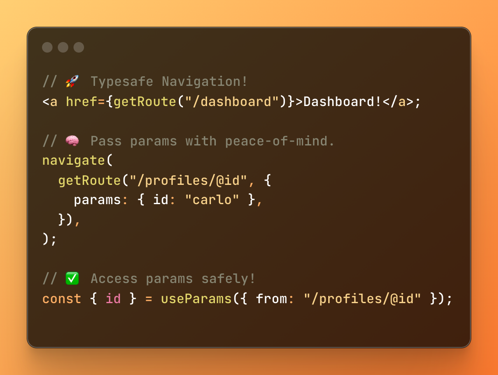

# Vike Routegen



A typesafe routing utility for [Vike](https://vike.dev) applications. Inspired by TanStack Start.

Forewarned, this is more like a temporary. For me, it's currently a feature-complete solution and I'll be using it for my projects. That's why it's published under a scoped package name.

But this also serves as an experiment for adding this into Vike's core.
[Vike is planning to make this a built-in feature](https://github.com/vikejs/vike/issues/698).

## Why Vike-Routegen?

## Why Vike-Routegen?

- ✨ **Zero dependencies** – a thin, transparent layer.
- 🔗 Typesafe links _anywhere_: arrays, hrefs, matching, whatever you need.
- 💡 Won’t hide or wrap your `<a>` components – thinly layered on your app without breaking existing types.
- ⚡ Fully code-generated for maximum type safety and zero runtime overhead, will still work in case of breaking changes.

## Installation

```bash
npm install -D @blankeos/vike-routegen
```

Add the plugin to your Vite config:

```ts
// vite.config.ts
import { defineConfig } from "vite";
import vikeRoutegen from "@blankeos/vike-routegen";

export default defineConfig({
  plugins: [
    // ...
    vike(),
    vikeRoutegen(), // Has sensible defaults + automatic detection (solid/react/vue), so it can be zero-config.
  ],
});
```

## Usage

Once installed, Vike Routegen will automatically generate a route tree file that provides typesafe routing utilities for your application.

### API

#### `getRoute()`

Generates typesafe route URLs based on your Vike pages:

```tsx
import { getRoute } from "./route-tree.gen";

// Regular route
const homeUrl = getRoute("/");
// 👉 Result: "/"

// Route with params
const postUrl = getRoute("/blog/@slug", {
  params: { slug: "my-awesome-post" },
});
// 👉 Result: "/blog/my-awesome-post"

// Route with search params
const searchUrl = getRoute("/search", {
  search: { query: "vike", category: "framework" },
});
// 👉 Result: "/search?query=vike&category=framework"

// Catch-all route
const docsUrl = getRoute("/docs/@", {
  params: { "@": ["guide", "getting-started"] },
});
// 👉 Result: "/docs/guide/getting-started"
```

#### `useParams()`

Access route parameters with full type safety:

```tsx
import { useParams } from './route-tree.gen'

function BlogPost() {
  // For routes like /blog/@slug
  const { slug } = useParams({ from: '/blog/@slug' }) // 📝 Quick tip: Avoid destructuring like this in SolidJS.

  // For catch-all routes like /docs/@ (e.g. /docs/a/b)
  // segments is ['a', 'b']
  // fullPath is '/a/b'
  const { '@': segments, '_@': fullPath } = useParams({ from: '/docs/@' }) // 📝 Quick tip: Avoid destructuring like this in SolidJS.

  return (
    // Your component using the params
  )
}
```

> ![NOTE]
> There are gotchas with SolidJS for reactivity to work with useParams.
> Make sure to not "destructure" the result. Also write the code like:
>
> ```tsx
> const routeParams = useParams({ from: "/docs/@" });
> routeParams().id; // It's an accessor.
> ```

## Optional Configuration

This is designed to work out-of-the-box with Vike and the
standard vike extensions, but you can also do the following.

```ts
vikeRoutegen({
  // Import source for usePageContext (used to generate useParams)
  // This is actually auto-detected from your vite.config.ts, but in cases
  // where it doesn't detect it correctly, just explicitly write it here like so:
  usePageContextImportSource?: "vike-react/usePageContext",

  // Output path for the generated file
  // Defaults to 'src/route-tree.gen.ts' if 'src' exists, otherwise 'route-tree.gen.ts'
  outputPath?: "src/routes.generated.ts",
});
```

Set `usePageContextImportSource` to `false` to disable the `useParams` utility. If you're not using
one of the standard vike extensions (vike-react, vike-solid, vike-vue).

BUGS I NOTICED:

- Catch all when it's on pages/@ (so something like pages/all/+route.ts = export default '\*'), it doesn't work.
- The `from` in useParams should be completely independent from what is being generated.
