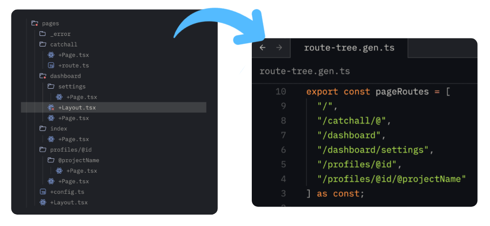
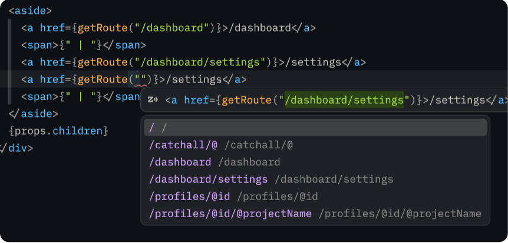
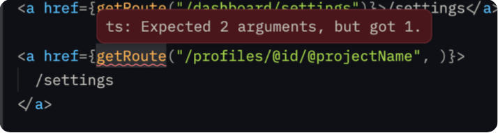
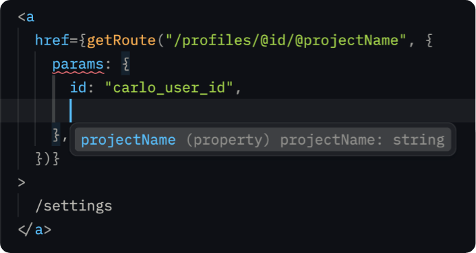
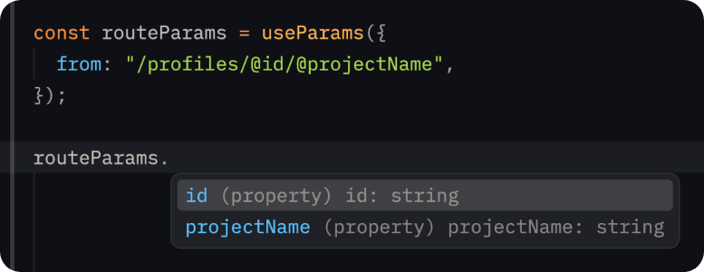

## Vike-Routegen (An experiment)

This experiment aims to replicate the DX that TanStack Start/Router has for Typesafe Routes, but in Vike, with just the current
features that Vike core and Vike-\* framework extensions have.

### How it works

- A vite `build` script runs every time a change is made during `vite` development. it creates `route-tree.gen.ts`.
- You get: `getRoute()` and `useParams()` as well.

I'm still figuring out how this can be more agnostic for `vike-react`, `vike-solid`, and `vike-vue` + maybe be part of `vike`.

**Currently achieved:**

- [x] Type-gen for route definitions.

  - [x] Regular routes (e.g. `/`, `/dashboard`)
  - [x] Nested routes (e.g. `/dashboard/profile`)
  - [x] Dynamic Routes (e.g. `/blog/@slug`)
  - [x] Catch-all or Splat routes (e.g. `/blog/@`) - [TanStack](https://tanstack.com/router/latest/docs/framework/react/routing/routing-concepts#splat--catch-all-routes) uses `$` like [Remix](https://remix.run/docs/en/main/file-conventions/routes#splat-routes) for splat routes.
  - [ ] TODO: Missed use-case, I'll have to check this: `/blog/@slug/@`. Output should be something like `{ slug: "123", @: ["123", "123", "123"] }`

- [x] Typesafe Route Navigation. `getRoute()`
- [x] Typesafe Route Param consumption. `useParams()`
- [ ] Typesafe Search Param consumption - `useSearch()` - Unachieveable currently without a core change in Vike (I think).

## APIs

### getRoute

The `getRoute()` function provides fully type-safe navigation for your routes.

I decided to implement a "utility" instead of a separate `<Link />`, `navigate()` utility. Because you can still use it like:
`<a href={getRoute("...")}>` or `navigate(getRoute("..."))`, with the same DX. Plus, still be able to opt out for more flexible usecases that the typesafety doesn't support.

Tells you if a route needs parameters.

Tells you which parameters to put into a route.

### useParams()

The `useParams()` hook gives you type-safe access to route parameters:

